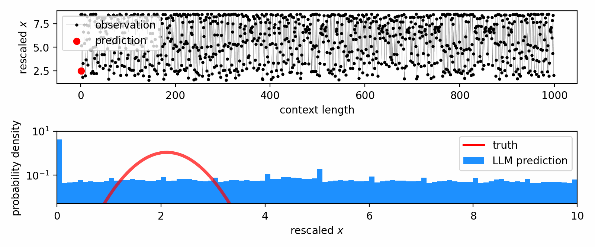

# LLMICL 

<!--  -->

## Overview
This repository contains official implementation of the paper:

   [LLMs learn governing principles of dynamical systems, revealing an in-context neural scaling law](http://arxiv.org/abs/2402.00795)

It contains code and data necessary to reproduce the experiments and generate the figures presented in the paper. Some of our data processing routine is adapted from [llmtime](https://github.com/ngruver/llmtime).

## Directory structure 
An overview of the repository's structure and contents:

- `/data`: Contains functions for converting time series data into string formats suitable for processing, alongside `series_generator.ipynb`, a Jupyter notebook for generating the dynamical system series explored in the paper.
- `/generated_series`: This directory holds all the dynamical time series data generated by the `series_generator.ipynb`.
- `/models`: Includes loaders for both the LLaMA and GPT models. It features `ICL.py`, which outlines essential packages like Hierarchy-PDF and its auxiliary functions. Additionally, `generate_predictions.py` is provided for applying the selected Large Language Model (LLM) to input time series and saving the outcomes using Hierarchy-PDF.
- `/processed_series`: A storage point for the predictions made by the LLM on each time series.
- `/figure_analysis`: Comprises routines for evaluating the LLM predictions found in the `/processed_series` directory, including the computation of metrics such as loss curves. It enables the reproduction of all figures presented in the paper.
- `/figures`: A repository for all figures generated through the analysis processes.

## Usage guidelines
Follow these steps to utilize the repository for generating dynamical system series, processing them with LLMs, and analyzing the results:

1. **Series Generation**:
   - Navigate to the `/data` directory and open `series_generator.ipynb`.
   - Define prediction tasks within this notebook, specifying one trajectory to predict per task, along with configurations for the chosen LLM and Hierarchy-PDF.
   - Execute the notebook to generate task files, and save these in the `/generated_series` directory as pickle files.

2. **Prediction Processing**:
   - Use `generate_predictions.py` found in the `/models` directory to process the generated series through the LLM, applying Hierarchy-PDF for prediction.
   - Save the processed task files, now containing LLM predictions, in the `/processed_series` directory as pickle files.

3. **Analysis and Figure Generation**:
   - With predictions stored in `/processed_series`, employ the routines within `/figure_analysis` to examine the transition rules extracted by the LLM.
   - Generate and review plots to visualize the analysis, replicating the figures from the paper.

  

### Authors

- [Toni J.B. Liu](https://antonioliu97.github.io/About_Me.html), jl3499@cornell.edu
- [Nicolas Boullé](https://nboulle.github.io/), nb690@cam.ac.uk
- [Raphaël Sarfati](https://raphaelsarfatixyz.wordpress.com/), raphael.sarfati@cornell.edu
- [Christopher J. Earls](https://earls.cee.cornell.edu/people/), earls@cornell.edu

